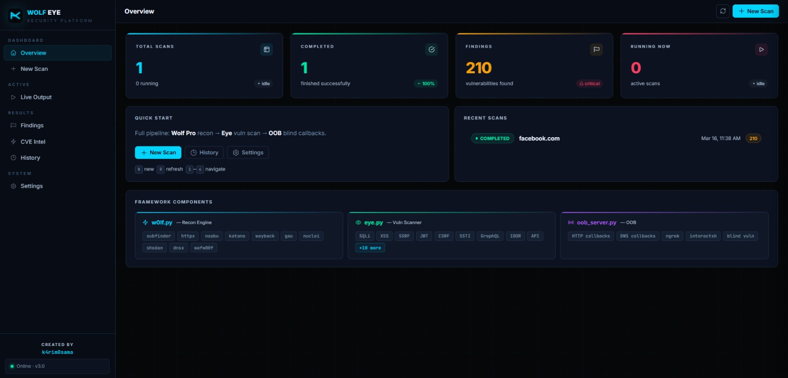
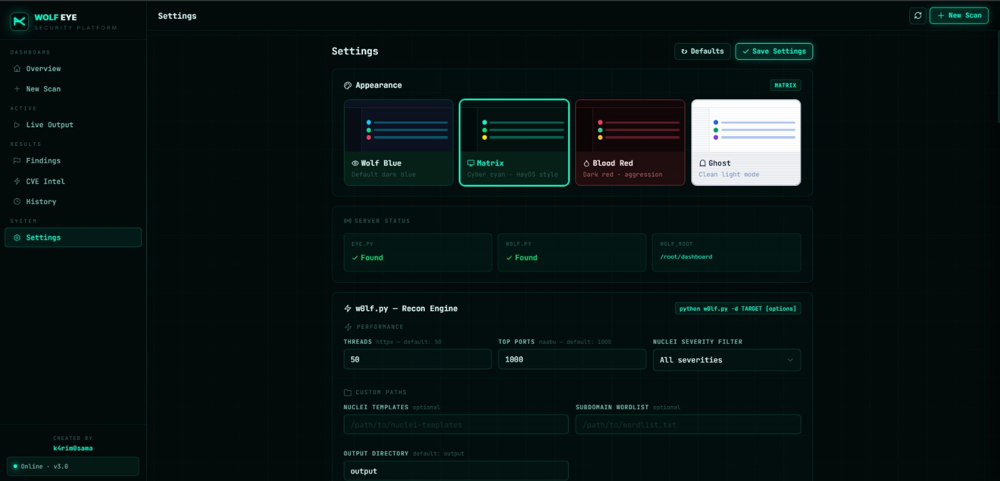

# 🐺 Wolf Eye Dashboard

> A professional web-based security dashboard for **Wolf Eye** — the Next-Gen Bug Bounty Automation Framework. Monitor live scans, triage vulnerabilities with AI, track OOB callbacks, and manage your entire recon pipeline from a single interface.

<br>

## 📸 Screenshots

<table>
  <tr>
    <td></td>
    <td></td>
  </tr>
</table>

<br>

## ✨ Features

### 🖥️ Live Output Terminal
- Real-time scan output streamed via WebSocket
- Color-coded log levels: `INFO` · `SUCCESS` · `WARN` · `ERROR` · `OOB`
- Auto-scroll with line counter and manual clear
- **WebSocket auto-reconnect** with exponential backoff — never miss output on long scans
- Reconnect banner with instant "Reconnect now" option

### 🔍 Scan Management
- **3 scan modes:** Full Pipeline · Recon Only · Eye Only
- Configurable OOB server, Telegram notifications, threads, confidence threshold
- Live progress bar · elapsed timer · critical findings counter
- Stop scan with full process tree kill (nuclei, subfinder, httpx, etc.)
- Persistent scan history with JSON storage across restarts

### 🤖 AI Triage Engine (Gemini)
- Per-finding AI analysis: real probability, exploitability score, priority level
- **False Positive detection** with confidence indicators (red / amber banners)
- "How to Verify" step-by-step manual verification guide
- Attack scenario description per finding
- **Custom Report Generation** — paste your own template, get a formatted report
- Bulk triage support
- Supports Gemini 3.x models (Flash Lite · Flash · Pro)

### 📡 OOB Callbacks Monitor
- Live panel below terminal showing Out-of-Band callbacks in real time
- **HTTP** and **DNS** type badges with timestamps
- Toast notification on new callback
- Automatically disabled for Recon Only scans (w0lf.py doesn't support OOB)
- Clear callbacks with one click
- Max 200 hits stored in memory

### 📊 Findings & CVE Intel
- Severity-filtered findings table: CRITICAL · HIGH · MEDIUM · LOW · INFO
- Full-text search across type, URL, target, details
- Expandable grouped view or flat view
- Export to CSV / JSON
- CVE Intel with CVSS scores, affected IPs, ports, hostnames from Shodan
- AI-powered triage panel slides in from the right

### 📈 Aggregated View (inside History)
- Cross-scan statistics: total findings, critical count, most vulnerable target
- **Top Targets** bar chart — color coded by worst severity
- **Most Common Vuln Types** bar chart
- Full grouped/flat findings table with pagination

### 🌐 Tunnel Support
- Built-in **ngrok** and **cloudflared** tunnel management
- Custom URL support
- Tunnel URL displayed in dashboard for remote access

### 🎨 Themes
- 4 themes: **Default** · **Matrix** · **Blood** · **Ghost**
- Full LED status indicator per theme
- Persistent theme selection

### ⚙️ Settings
- All w0lf.py and eye.py parameters configurable from the UI
- Telegram bot integration
- Gemini API key and model selection
- OOB server defaults
- Saved to `settings.json`, applied on every scan

<br>

## 🚀 Quick Start

### Prerequisites
- Python 3.8+
- [Wolf Eye](https://github.com/k4rim0sama/wolf_eye) installed in the parent directory (or set `WOLF_ROOT`)

### Installation

```bash
# Clone the dashboard into your Wolf Eye directory
cd wolf_eye
git clone https://github.com/k4rim0sama/wolf_eye_dashboard wolf_dashboard
cd wolf_dashboard

# Start (auto-installs dependencies)
bash start.sh
```

Then open **http://localhost:8080** in your browser.

### Manual Start

```bash
pip install -r requirements.txt
python server.py
```

<br>

## 📁 Project Structure

```
wolf_eye/                  # Wolf Eye root (parent)
├── eye.py                 # Vulnerability scanner
├── w0lf.py                # Recon framework
├── oob_server.py          # OOB callback server
└── wolf_dashboard/        # ← This repo
    ├── static/
    │   └── index.html     # Single-file SPA frontend
    ├── server.py          # FastAPI backend
    ├── start.sh           # Quick start script
    ├── requirements.txt   # Python dependencies
    ├── scans.json         # Persistent scan history (auto-generated)
    └── settings.json      # Saved settings (auto-generated)
```

<br>

## 🔧 Configuration

### Environment Variables

| Variable | Default | Description |
|----------|---------|-------------|
| `WOLF_ROOT` | `../` | Path to Wolf Eye root (where `eye.py` and `w0lf.py` live) |
| `WOLF_SETTINGS_TOKEN` | _(none)_ | Optional token to protect the settings API |

### Scan Types

| Type | Tool | OOB Support | Description |
|------|------|-------------|-------------|
| `full` | eye.py | ✅ | Full pipeline: recon + vulnerability scanning |
| `recon-only` | w0lf.py | ❌ | Subdomain enumeration + live host discovery only |
| `eye-only` | eye.py | ✅ | Vulnerability scanning on existing recon output |

<br>

## 🤖 AI Triage Setup

1. Get a free API key from [Google AI Studio](https://aistudio.google.com)
2. Open **Settings** in the dashboard
3. Paste your key in **Gemini API Key**
4. Select your preferred model
5. Click any finding → **AI Triage** button

### AI Triage Output

- `is_real` — probability the finding is a real vulnerability (0–100%)
- `exploitability` — how easy it is to exploit if real
- `priority` — P1 (Critical) to P4 (Low)
- `fp_indicators` — reasons it might be a false positive
- `verify_steps` — manual steps to confirm the finding
- `attack_scenario` — what an attacker could do if exploited

<br>

## 📡 OOB (Out-of-Band) Detection

OOB detection catches **blind vulnerabilities** that don't show up in HTTP responses:

| Vulnerability | How OOB Helps |
|---------------|---------------|
| Blind SSRF | Server makes DNS/HTTP request to your OOB domain |
| Blind XSS | Payload executes in admin browser, calls home |
| XXE | XML parser fetches external entity via DNS |
| Log4Shell / JNDI | JNDI lookup triggers DNS callback |
| Blind SQLi (OOB) | Database makes DNS query (Oracle, MSSQL) |

**DNS callback** = partial proof (server resolved your domain)  
**DNS + HTTP callback** = full proof (server made a complete request)

<br>

## 🌐 Remote Access via Tunnel

```
Settings → Tunnel → Select provider → Start
```

Supported providers:
- **ngrok** — requires authtoken from ngrok.com (free tier available)
- **cloudflared** — requires `cloudflared` binary installed
- **Custom URL** — paste any pre-existing public URL

<br>

## 📱 Mobile Support

The dashboard is fully responsive and works on mobile browsers. A bottom navigation bar replaces the sidebar on small screens.

<br>

## ⚙️ API Reference

| Method | Endpoint | Description |
|--------|----------|-------------|
| `POST` | `/api/scans` | Start a new scan |
| `GET` | `/api/scans` | List all scans |
| `GET` | `/api/scans/{id}` | Get scan details |
| `POST` | `/api/scans/{id}/stop` | Stop a running scan |
| `DELETE` | `/api/scans/{id}` | Delete a scan |
| `GET` | `/api/scans/{id}/findings` | Get parsed findings |
| `GET` | `/api/scans/{id}/cves` | Get CVE intel |
| `GET` | `/api/scans/{id}/output` | Get saved terminal output |
| `WS` | `/ws/{id}` | WebSocket stream for live output |
| `POST` | `/api/triage/{id}/{idx}` | AI triage a single finding |
| `POST` | `/api/triage/{id}/bulk` | Bulk AI triage |
| `GET` | `/api/oob/hits` | Get OOB callbacks |
| `DELETE` | `/api/oob/hits` | Clear OOB callbacks |
| `GET` | `/api/settings` | Get settings |
| `POST` | `/api/settings` | Save settings |
| `GET` | `/api/tunnel` | Get tunnel status |
| `POST` | `/api/tunnel/start` | Start tunnel |
| `POST` | `/api/tunnel/stop` | Stop tunnel |
| `GET` | `/api/health` | Health check |

<br>

## 🛠️ Tech Stack

| Layer | Technology |
|-------|-----------|
| Backend | Python 3.8+ · FastAPI · Uvicorn · WebSockets |
| Frontend | Vanilla JS · Single HTML file · No build step |
| AI | Google Gemini API (gemini-3.x) |
| Persistence | JSON flat files |
| Tunnel | ngrok (pyngrok) · cloudflared |

<br>

## 📝 License

This project is part of the Wolf Eye ecosystem.  
Built with ❤️ by **k4rim0sama**

---

> **Wolf Eye Dashboard** is a companion tool. It requires [Wolf Eye](https://github.com/KarimOsama99/w0lf) to run scans — the dashboard itself only provides the UI layer.
